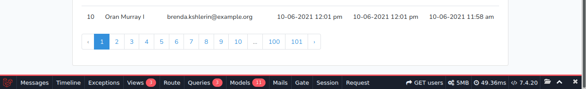
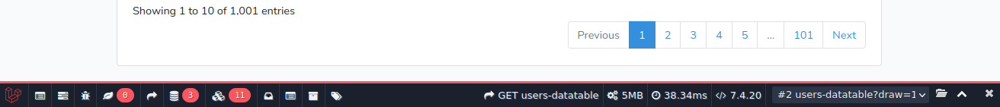
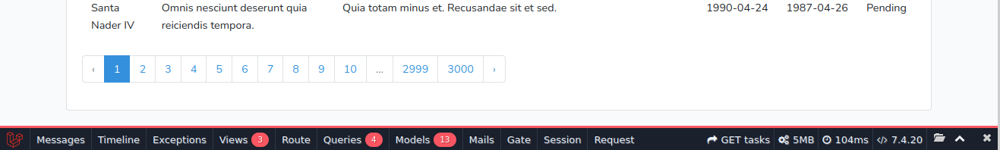
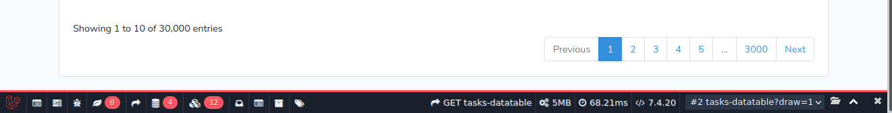

# Paginate vs Datatable render time comparison

## Installation
- Clone this repo
- then 
```shell
composer install
cp .env.example .env
subl .env
```
- Edit .env with db credentials
- then
```shell
php artisan migrate
php artisan db:seed # Be advised: It will start seeding 100000 user with 3000 task per user
php artisan key:generate
```
## Some screenshots

### Paginated User


### User Datatable


### Paginated Task


### Task Datatable

